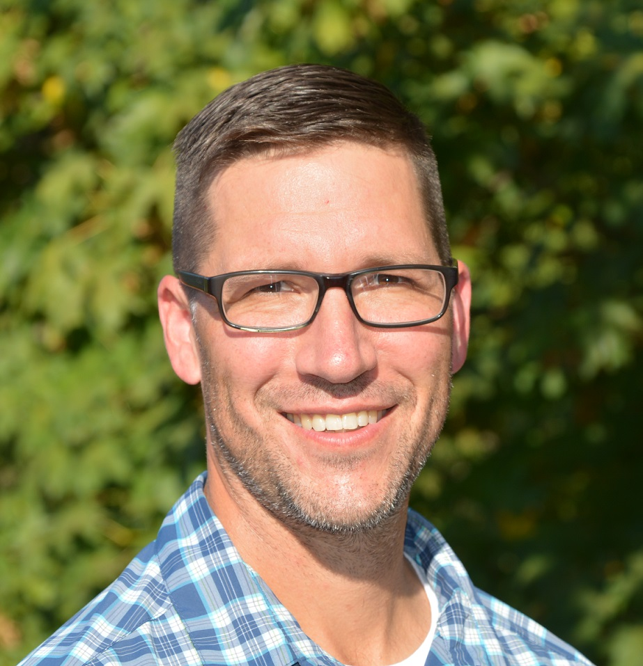

## Who I Am

::::: columns
::: {.column width="40%"}
{fig-alt="photo of Kevin Bladon" fig-align="center" width="262"}
:::

::: {.column width="60%"}
I joined Oregon State University in 2014 working on issues related to land use and natural disturbance impacts on hydrology, water quality, and aquatic ecosystem health at the hillslope, stream reach, and small catchment scale.

My goals are to: build effective collaborations across Oregon, North America, and internationally; train the next generation of research leaders; provide an atmosphere of respect and learning; engage the public and stakeholders, and; develop leading edge, novel research to solve applied problems.
:::

## Education and Work History

::: {.no-row-lines}

|  |  |
|------------------|------------------------------------------------------|
| **2024 - Present** | Professor - Forest Hydrology and Watershed Science (Oregon State University, Corvallis, OR) |
| **2023 - Present** | Department Head - Department of Forest Ecosystems and Society (Oregon State University, Corvallis, OR) |
| **2021 - 2023** | Associate Department Head - Department of Forest Engineering, Resources, and Management (Oregon State University, Corvallis, OR) |
| **2020 - 2024** | Associate Professor - Forest Hydrology and Watershed Science (Oregon State University, Corvallis, OR) |
| **2014 - 2020** | Assistant Professor - Forest Hydrology and Watershed Science (Oregon State University, Corvallis, OR) |
| **2012 - 2014** | Research Associate - Watershed Hydrology (University of Alberta, Edmonton, AB) |
| **2009 - 2012** | Assistant Professor (3 year term) - Watershed Hydrology (Thompson Rivers University, Kamloops, BC) |
| **2008 - 2009** | Watershed Management Research and Extension Specialist (FORREX, Kelowna, BC) |
| **2006 - 2008** | Post-Doctoral Fellow - Ecohydrology (University of Alberta, Edmonton, AB) |
| **2006 - 2006** | Natural Resources Management Consultant - Forest Hydrology Specialist (Edmonton, AB). |
| **2002 - 2006** | PhD Forest Hydrology / Ecohydrology (University of Alberta, Edmonton, AB). |
| **1999 - 2002** | BSc Environmental and Conservation Sciences (University of Alberta, Edmonton, AB). | 

:::

## Teaching

**FE 434** - Forest Watershed Management (OSU)

**FE 436/FE 536** - Forest Disturbance Hydrology (OSU)

**FE 532** - Forest Hydrology (OSU) *Currently unavailable*

**ENVS 5480** - Fundamentals of Hillslope Hydrology (TRU)

**NRSC 4110** - Watershed Management (TRU)

**NRSC 4130** - Fire Ecology and Management (TRU)

**NRSC 1120** -Dendrology 1 (TRU)

**NRSC 1220** - Dendrology 2 (TRU)

**RENR 350** - Physical Hydrology (U of A)
:::::
