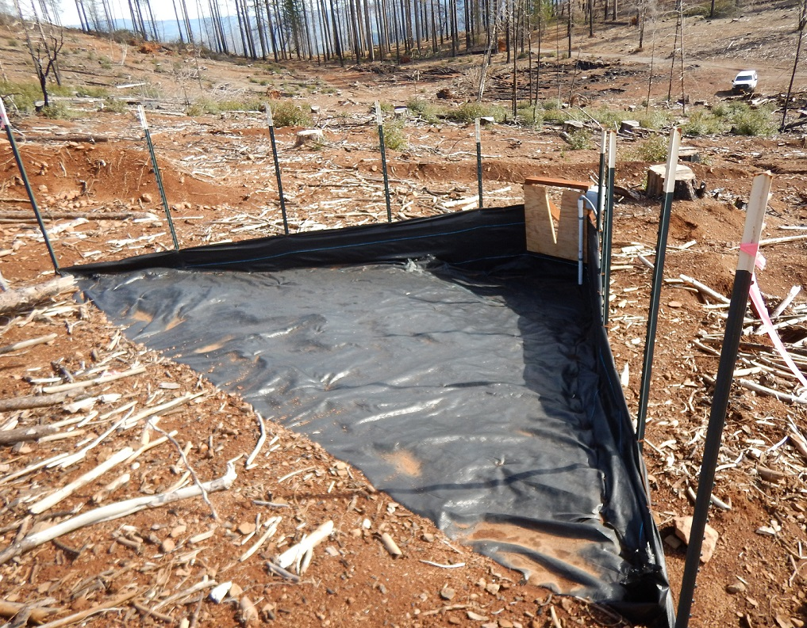
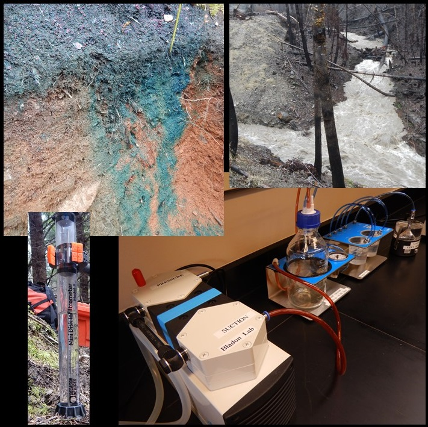
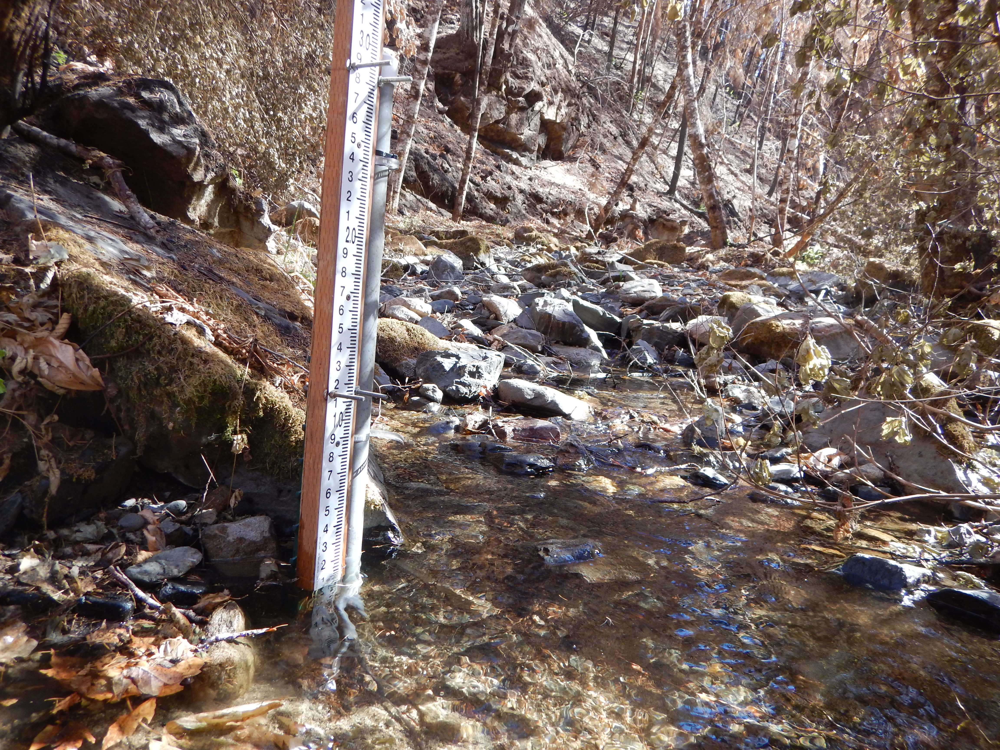
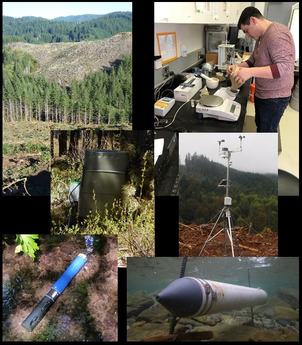
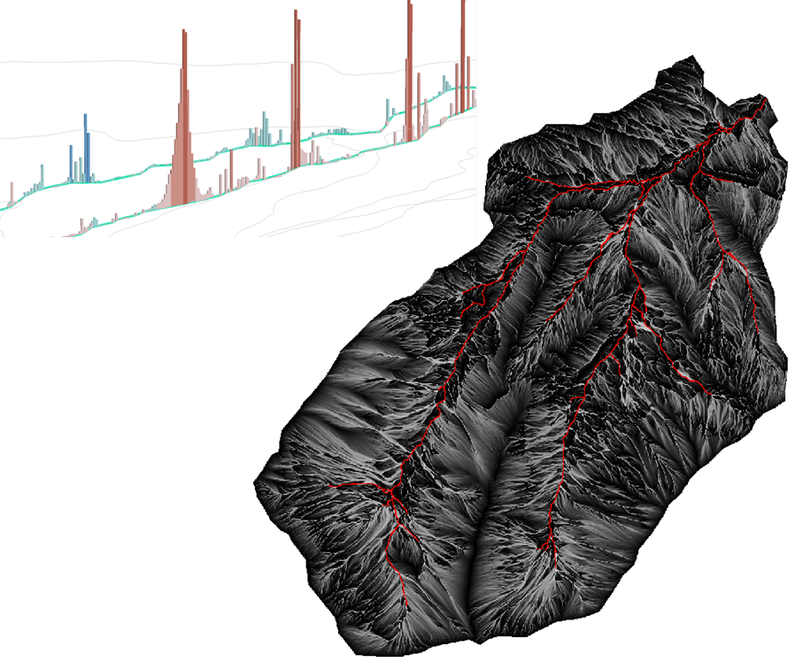

::: {.project-box}

{fig-alt="Sediment Fence set up on logged hillslope"}

## Post-fire forest management effects on runoff and erosion

Forest managers are increasingly faced with the task of recovering the value of burned timber while providing for water quality protection. Very little information is available regarding the impacts of post-fire management, particularly in California. Recent studies in other areas in the western U.S. have indicated that post-fire forest management may increase local surface runoff and erosion rates because of soil compaction, surface disturbance, and delay of vegetative recovery related to heavy equipment traffic. By assessing water quality responses to post-fire management treatments, we can provide managers with tools to help mitigate potential water quality impacts. This line of inquiry will quantify runoff, erosion, and sediment responses to wildfire, post-fire logging, and reforestation activities. We are also evaluating and demonstrating new BMPs for post-fire logging.

This research is occurring at the Boggs Mountain Demonstration State Forest, which was burned in 2015 during the Valley Fire in Lake County, California. The fire burned approximately 30,750 ha (76,000 acres) of forest land. Research is in collaboration with CAL FIRE (Drew Coe) and USFS PSW Research Station (Joe Wagenbrenner)

:::

::: {.project-box} 
{fig-alt="Various tools to measure soil hydraulic properties" width="100%"}

## Wildfire effects on soil hydraulic properties

We are determining the initial and longer-term effects of wildfire on soil hydraulic properties. This line of inquiry combines both field and lab based analyses to understand how soil hydraulic properties are impacted by severe wildfire. We are also relating these effects to spatial and temporal dynamics of soil water content, runoff generation, and vegetation recovery.

:::

::: {.project-box} 
{fig-alt="Staff plate installed ina small rocky stream" width="100%"}

## Water quantity and quality following wildfire

Exploring the factors that control stream water quantity, physical water quality (turbidity, sediment, temperature), and chemical water quality (N, P, C) responses to severe wildfire in mountain streams and quantifying their effects on stream ecosystems.

Three burned watersheds (Stouts Creek East, Stouts Creek Main, Callahan Creek) and one reference watershed (Shively Creek) have been instrumented with hydrometeorological stations to address questions regarding the initial impacts and recovery following the 2015 Stouts Creek wildfire (10,704 ha) in southern Oregon.

:::

::: {.project-box} 
{fig-alt="Various tools to measure sediment in streams." width="100%"}

## In-stream sources of suspended sediment following forest harvesting

Erosion and transport of suspended sediment is a natural process that influences forested headwater streams. However, if suspended sediment concentrations rise above naturally occurring levels this can degrade aquatic ecosystems. Due to the perceived impacts of sediment on aquatic ecosystems, the Oregon Department of Environmental Quality (DEQ) has established a standard for suspended sediment, which states that forest management activities cannot result in more than a ten percent cumulative increase in natural stream turbidity. As such, accurate estimates of turbidity and sediment yields and identification of the principal sources of sediment are critical to our ability to manage the erosion and sedimentation response to forest harvesting activities in order to meet DEQ standards. The primary objectives of this research are to determine a) turbidity and sediment yield responses to forest harvesting in headwater streams of the Oregon Coast Range, b) how the primary sources of suspended sediment to streams vary between forested and harvested watersheds, and c) if the primary sources of sediment change logitudinally from stream head to outlet.

:::

::: {.project-box} 
{fig-alt="Outputs from a streamflow model showing modeled flowpaths in a basin." width="100%"}

## Hillslope hydrology and biochemistry linked to catchment scale observations

Investigating linkages between upslope accumulated area (UAA), hydrologic connectivity, hillslope biochemistry, and in-stream water quality. The broad objectives of this area of inquiry are to transfer reach- and hillslope-scale understanding of potential 'hot spots' and 'hot moments' for water quality change to the catchment scale. Field data will be used to develop and/or improve hydrologic and biochemical models.

:::
